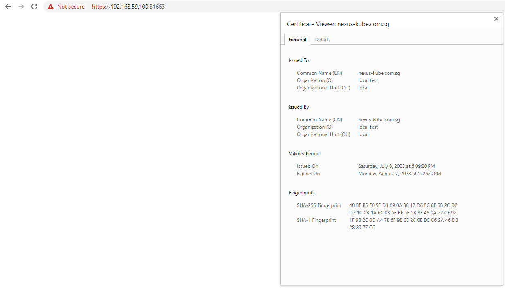
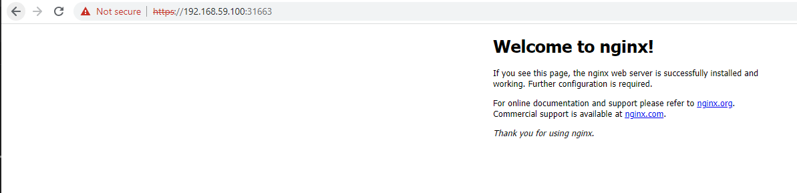

# NGINX SERVER installation in kubernetes using helm
## Version installed : latest
## Self signed certificates are used
### CN : nexus-kube.com.sg
## Volume mounts for secrets , config files 

# Command used 
helm install nginx ./nginx-helm

NAME: nginx
LAST DEPLOYED: Sun Jul  9 13:55:41 2023
NAMESPACE: default
STATUS: deployed
REVISION: 1
TEST SUITE: None

# Log post helm installation

# Screencapture of certificate post nginx setup

# Screencapture of nginx landing page
