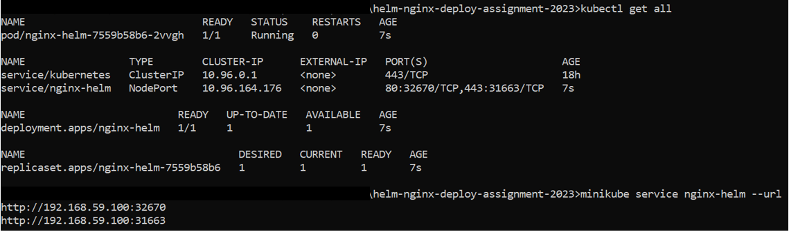
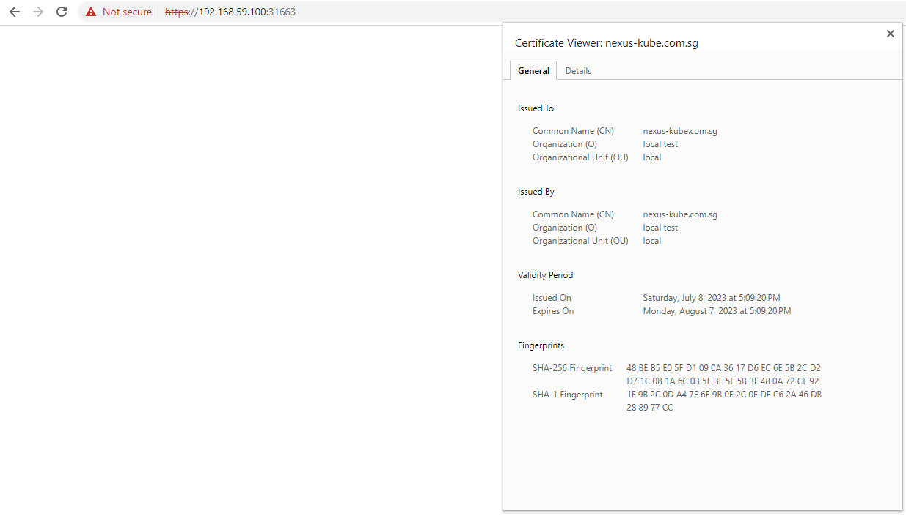
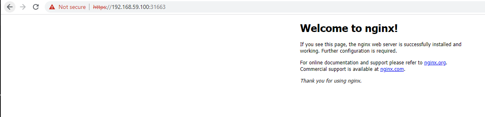

# NGINX SERVER installation in kubernetes using helm
     Version installed : latest
     Self signed certificates are used 
     CN : nexus-kube.com.sg
     kubernetes Volume mounts are used for secrets , config files 

### Command used 
helm install nginx ./nginx-helm

    NAME: nginx
    LAST DEPLOYED: Sun Jul  9 13:55:41 2023
    NAMESPACE: default
    STATUS: deployed
    REVISION: 1
    TEST SUITE: None

# Log post helm installation

# Screencapture of certificate post nginx setup

# Screencapture of nginx landing page
